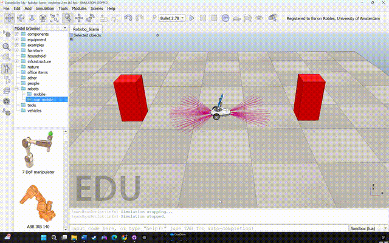
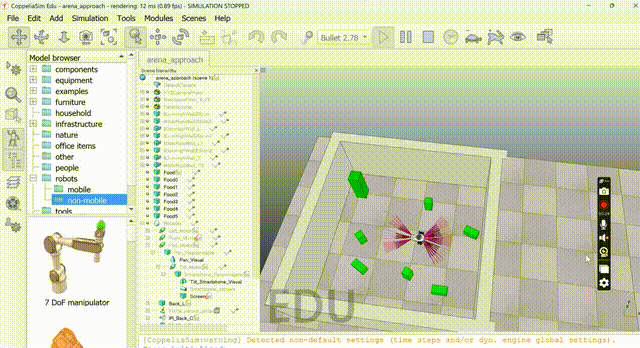
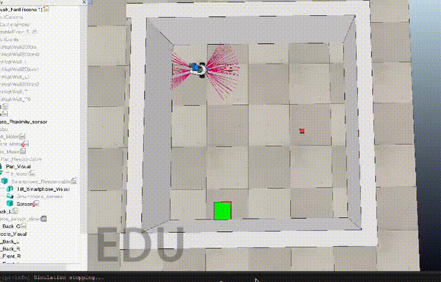

# Learning Machines course (VU)

This repository contains our 4-week Learning Machines project, where we trained a small wheeled Robobo robot in simulation (CoppeliaSim + ROS) and then tested policies on real hardware.

The most relevant work is in:
`examples/full_project_setup/catkin_ws/src/learning_machines`

This was a joint project with Helia Ghasemi, Esrion Robles and Valeria Sepicacchi. 

## What We Focused On

- Reinforcement learning for robot control under partial observability (IR sensors + camera).
- Sim-first training with hardware evaluation (sim-to-real transfer).
- Iterative environment design: better state representations, reward shaping, and reset randomization.

## Week-by-Week Approach

### Week 1: baseline robot control and environment interaction

We established the basic functionality of both the robot's physical controls, and the sensitivty of the robot's IR sensors. As it turns out, not all sensors were equally sensitive, which had to be adjusted for in downstream tasks. In this small demo, you observe the robot travelling forward until it senses an obstacle, before reversing before it encounters another obstacle: 

### Week 2: early RL baselines - scene navigation.
Explored the different considerations of training a robot with RL on a given task, in this case: object avoidance. Amongst these what emerged as most important were:
- the choice of scene and action representation,
- which RL algorithm to implement,
- how to design the reward function.

Initial approach involved using a continuous action space, and [PPO](https://en.wikipedia.org/wiki/Proximal_policy_optimization).  The robot was allowed both forward and backwards motion, and used the input from all sensors in scene representation. 

  - Over-engineered for the problem at hand. Proved difficult to identify where precisely it was failing: 
    - RL algorithm implementation, 
    - scene representation pipeline 
    - action implementation

Consequently, we simplified. We switched to 
- [DQN](https://en.wikipedia.org/wiki/Q-learning#Deep_Q-learning) to learn
- discretized action space - only allowing 5 actions corresponding to forward movements (E, NE, N, NW, W) to prevent reward hacking.

### Week 3 (foraging, stronger results):

The task is now multi-modal: collect green boxes quickly (visual data) while avoiding wall collisions (IR data).

- Designed a structured state representation: the five front IR sensors normalized and a vision pipeline using color thresholding + cv2 bounding box extraction (normalized coordinates).

- Implemented a discrete 5-action space via wheel-speed mappings, removing backward motion to prevent spurious reward exploitation.
- Integrated Gym into our workflow to use StableBaselines3 implementation of DQN - improved efficiency and abstraction.

- Engineered shaped rewards to prioritize:
  - Box collection 
  - Wall avoidance 
  - Efficiency 

- Introduced staged randomization of initial pose (increasing frequency over training) to mitigate overfitting and reduce the reality gap.

- Benchmarked multiple trained agents in controlled evaluation runs. This allowed us to observe stabilization of episodic reward in later training despite perturbations of starting scene.

### Week 4 (puck pushing, strongest RL focus):

We reformulated task as sequential control: 
  1. forage for the red puck, then 
  2. push it to the green goal zone

- Used SAC instead of discrete DQN. This was necessitated by needing finer motion control than a discrete action space allowed. Between SAC and PPO, found SAC had better sample efficiency and robustness to noised starting configuration.

- Designed task-specific reward shaping:
  - Collision penalties via outermost IR sensors. 
  - Monotonic improvement rewards (new best distance to puck/goal), delivery bonus, penalty for losing puck, small per-step cost for efficiency 

- Introduced staged domain randomization featuring progressive randomization of puck start position based on rolling success rate 

- Addressed reality gap issues:
Camera flipping and offset correction between simulation and hardware.
Sensor-based collision detection when puck occluded central sensors. 

